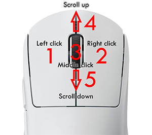

# Hooks
{: .no_toc }

## Table of contents
{: .no_toc .text-delta }

1. TOC
{:toc}

---

In computer programming, the term *hooking* covers a range of techniques used to
alter or augment the behaviour of an operating system, of applications, or of
other software components by intercepting function calls or messages or events
passed between software components. Code that handles such intercepted function
calls, events or messages is called a hook.

## Introduction

Hooking is used for many purposes, including debugging and extending
functionality. Examples might include intercepting keyboard or mouse event
messages before they reach an application, or intercepting operating system
calls in order to monitor behavior or modify the function of an application or
another component. It is also widely used in benchmarking programs, for example
to measure frame rate in 3D games, where the output and input is done through
hooking.

Simply put, it is therefore not weird that hooking is the backbone of MiniLibX.

## Hooking into key events

Hooking may sound difficult, but it really is not. Let's take a look shall we?

```c
#include <mlx.h>
#include <stdio.h>

typedef struct	s_vars {
	void	*mlx;
	void	*win;
}				t_vars;

int	key_hook(int keycode, t_vars *vars)
{
	printf("Hello from key_hook!\n");
	return (0);
}

int	main(void)
{
	t_vars	vars;

	vars.mlx = mlx_init();
	vars.win = mlx_new_window(vars.mlx, 640, 480, "Hello world!");
	mlx_key_hook(vars.win, key_hook, &vars);
	mlx_loop(vars.mlx);
}
```

We have now registered a function that will print a message whenever we press
a key. As you can see, we register a hook function with `mlx_key_hook`. However
in the background it simply calls the function `mlx_hook` with the appropriate
X11 event types. We will discuss this in the next chapter.

## Hooking into mouse events



Also, you can hook mouse events.

```c
mlx_mouse_hook(vars.win, mouse_hook, &vars);
```
Mouse code for MacOS:
  - Left click: 1
  - Right click: 2
  - Middle click: 3
  - Scroll up: 4
  - Scroll down : 5  


## Test your skills!

Now that you have a faint idea of what hooks are, we will allow you to create a
few of your own. Create hook handlers that whenever:
- a key is pressed, it will print the key code in the terminal.
- the mouse if moved, it will print the current position of that mouse in the
terminal.
- a mouse is pressed, it will print the angle at which it moved over the window
to the terminal.


